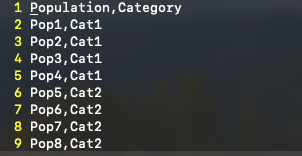
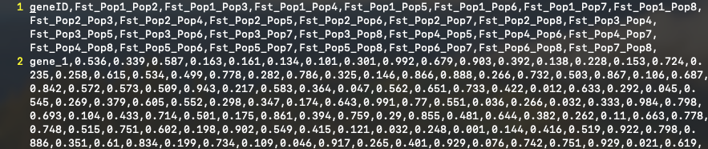
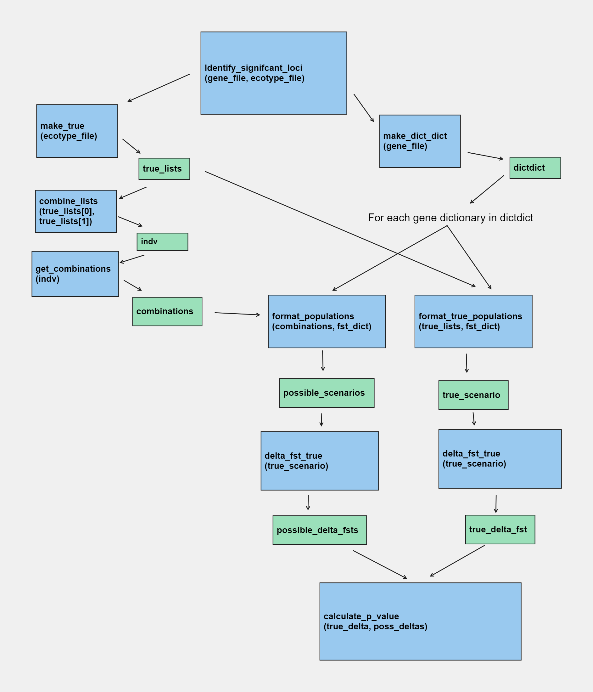

# CatPop Combinatorics

This software package uses combinatorics to create all possible scenarios of two
population assignments, performs a permutation test for each comparison, and
generates a p-value distribution plot, along with graphs that show the association of between/within
ecotype comparisons, and additionally returns the genes of significance.

There is also a random number generator to ensure the accuracy of your data.

# Contents
* Program Requirements
* Instructions
* Outputs
* Example
* Other Information
* Flow of Data

## Program Requirements
To get the full usage out of the repository, you will need:
1. Git
2. Latest version of Python
3. R, with the packages optparse, ggplot2, reshape2, and tidyverse. To install these
   packages associated with R, enter R and the command to install is:
   ```install.packages("optparse", "tidyverse", "ggplot2", "reshape2") ```

# Instructions
### Step 1: Cloning the Repository
1. Ensure you have git installed. Instructions on installing git can be found
[here](https://git-scm.com/downloads)
2. Open your terminal and navigate to the directory you wish to put the
   repository. This would look something like ```cd ~/GitHubRepositories```
3. Assuming you are reading this, you are on the page of the repository. Scroll up to click on the green clone button and copy
   the repository's URL for cloning. Then, on your terminal, use the command:
   ```
   git clone <repository URL>
   ```
4. Git then downloads the entire repository to your local device.  You'll see
   progress information as the cloning takes place.
5. Once cloning is complete, you'll have a copy of the repository on your local
   machine in the subdirectory with the same name as the repository. You now
   should navigate into this directory to use functions this repository has.

### Step 2: Implementing file structure
1. This program takes in two files as input. Your two files must have a
   particular format.
2. For the categorical assignment file, please review
   ```rand_example_categories.csv``` for the proper format assignments.<br />
   This image has a basic layout:<br />
   <br />
   <br />
   <br />
   A consistent naming convention for you categories will make your results much
   more understandable. This input file should be named:
   ```<input_prefix>_categories.csv```
3. For the format of the fst file, please review ```rand_example_fst.csv```.
   This image shows a basic layout:<br />
   <br />
   <br />
   <br />
   Note that you may label these as you wish,
   but the columns need to be labelled with the underscore between population names.
   formatting. Also, the input file needs to be named
   ```<input_prefix>_fst.csv```

*Please Note: comparisons with non-numeric fst values will be ignored.

### Step 3: Running CatPop
1. Ensure you have all the program requirements (see above)
2. Open your terminal and navigate to CatPop directory
3. Type the following
```
python main.py -i <input_file_prefix>
```
4. CatPop will notify you the process was initialized, and once finished, you will see a message describing the names of the output
  files.

### Step 4: Initializing R to get histogram (optional)
1. Ensure you have the "optparse" package for R installed. If you don't have
   this package, this command will not work!
2. Next, I'd recommend using the command and copying your path:
```
pwd
```
3. NOT REQUIRED, but that there are several options you can adjust when using this command. You can label your output file what you prefer by changing the text after '-o', change the p-value delineation by adjust the value after '-p', and change the amount of bins with '-b'. <br />
4. You MUST change your working directory after the '-d'. This is what you
  copied after using the ```pwd``` command. <br />
5. There is a R Argument parser within the directory. The command that will work
   for you is a variation of this command:
```
Rscript create_plots.R -i <input_prefix>_all_output.csv -o <input_prefix>_plots.pdf -p 0.05 -b 50 -d '/your/path/where/you/saved/CatPop'
```
Below is what the plots look like.<br />
*[Example of P-value Histogram](Diagrams/rand_density_plot.pdf)<br />
*[Visualization of Compares](Diagrams/rand_fst_exons_plot.pdf)<br />
## Outputs

The outputs of this program is as follows:
* p-value plot, which will need to be initilaized through R
* Ecotype comparison of within and between plot
* results.txt, which will list all the genes and their related p-values
* log.txt, which will contain all the genes with a p-value below .05
* sig_output.csv shows the significant genes
* all_output.csv reports every delta_fst and p-values for the genes

# Example
The following is how I ran CatPop on my terminal after using the random value
generator. Please note, I already had all
the program requirements installed. <br />

1. I cloned repository using the command: <br />
```
git clone https://github.com/KLab-UT/CatPop.git
```
2. In the CatPop directory, I created the file 'rand_example_categories.csv', and named the populations,
   along with what 'category' they were in. The input prefix is therefore
   'rand_example'. Assign your categories in relation
   to your data.
3. I used the random number generator to obtain the 'genetic divergence' values,
   as well as formatting my file type. The file created was called
   'rand_example_fst.csv', which follows the input prefix naming convention of
   'rand_example'.
4. Now that my files were formatted and named appropriately, I ran CatPop on my
   csv files with this function:
   ```
   python3 main.py -i rand_example
   ```
5. To get the Rscript to automatically generate my plots with this title:
```
   rand_example_density_plot.pdf
```
I used this command:
```
Rscript create_plots.R -i rand_example_all_output.csv -o rand_example_density_plot.pdf -p 0.05 -b 50 -d '/Users/myusername/GitHubDirectories/CatPop'
```
# Other Information
If you get an error saying "Fst_Pop1_Pop2 and Fst_Pop2_Pop1 not found, check your input files and verify that the populations are spelled exactly the same in the fst and ecotype files.

# Flow of Data

Please refer to the image below to understand the flow of data through the
program.

