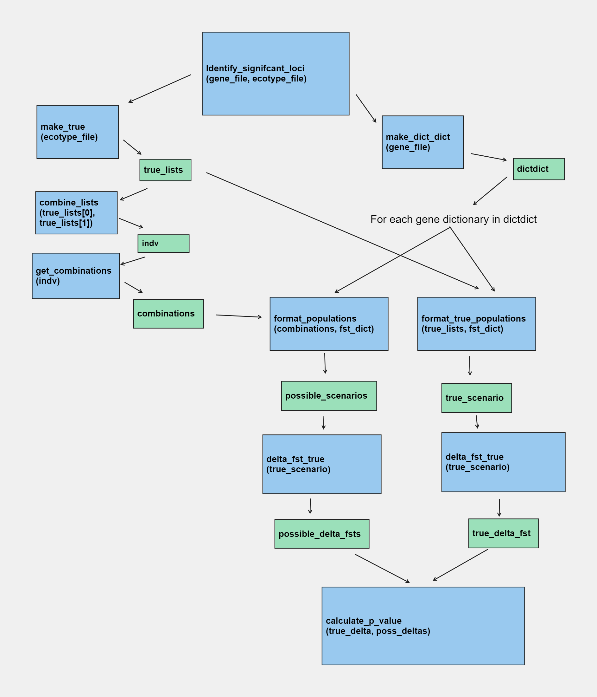

# PopCat Combinatorics

This software package uses combinatorics to create all possible scenarios of two
population assignments, performs a permutation test for each comparison, and
generates a p-value distribution plot, along with graphs that show the association of between/within
ecotype comparisons, and additionally returns the genes of significance.

There is also a number generator to ensure the accuracy of your data

# Contents
* Flow of data and Outputs
* Instructions to implement your comparisons
* Other information

# Flow of Data

Please refer to the image below to understand the flow of data through the
program.

The outputs of this program is as follows:

* p-value plot
* Ecotype comparison of within and between plot
* results.txt, which will list all the genes and their related p-values
* log.txt, which will contain all the genes with a p-value below .05
* sig_output.csv shows the significant genes
* all_output.csv reports every delta_fst and p-values for the genes

# Instructions to Implement your Comparisons
Your input file needs to be a csv file, review exons.popgen.csv to ensure you
have the correct format. The columns need to be labelled accordingly, with the
underscore between the population names. nan values are okay, the code accounts
for this.

Assign your True scenarios in CorrectEcotypeAssignments.csv, copying the format.

Edit main.py so that on line 8, the correct names are used in association with
the data you'd like to use.

Run main.py, and review results

# Other Information

